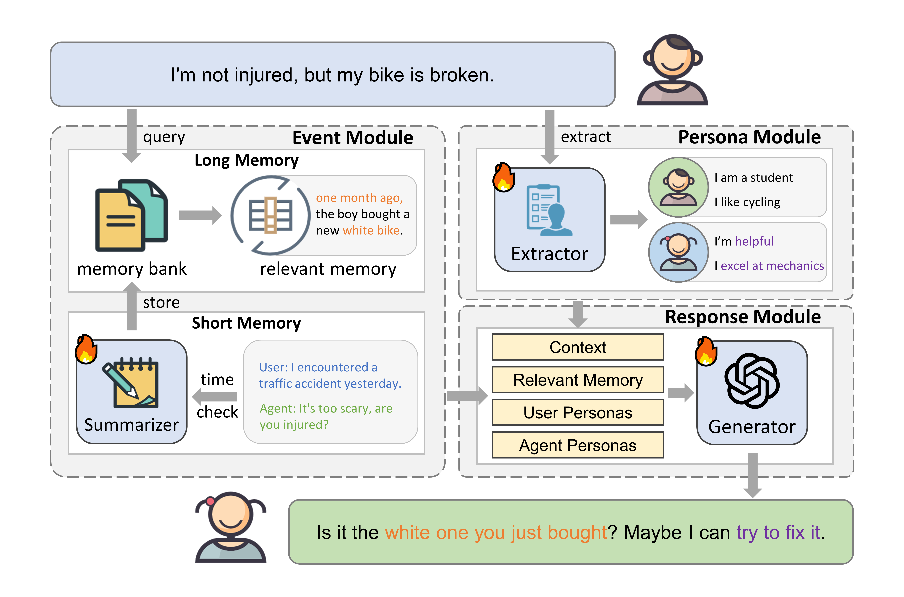
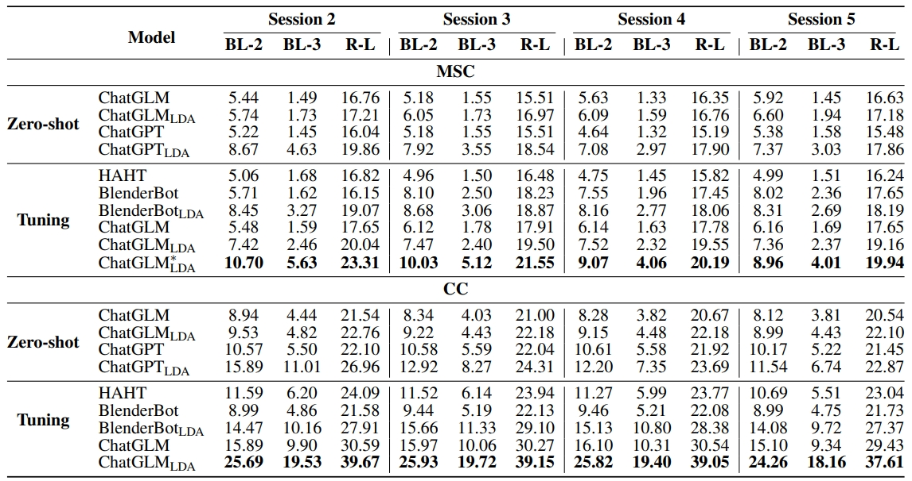

<div align=center>

<h1>Hello Again! LLM-powered Personalized Agent for Long-term Dialogue</h1>

<a href="LICENSE">

</a>

<div>
      <a href="https://leolee99.github.io/" target="_blank">Hao Li</a><sup>1</sup><sup>*</sup>,
      <a href="https://syuchin.github.io/" target="_blank">Chenghao Yang</a><sup>2</sup><sup>*</sup>,
    <a href="https://anzhang314.github.io/" target="_blank">An Zhang</a><sup>1</sup><sup>&dagger;</sup>,
    <a href="https://dengyang17.github.io/" target="_blank">Yang Deng</a><sup>3</sup>,
      <a href="https://xiangwang1223.github.io./" target="_blank">Xiang Wang</a><sup>2</sup>,
      <a href="https://www.chuatatseng.com/" target="_blank">Tat-Seng Chua</a><sup>1</sup>,

<div>
  <sup>1</sup>National University of Singapore
       </div>   
  <sup>2</sup>University of Science and Technology of China
       </div>   
  <sup>3</sup>Singapore Management University


<p align="center" style="overflow:hidden;">
 
</p>

<p align="center" style="overflow:hidden;">
 
</p>

</div>

The official implementation of NAACL 2025 paper **"[Hello Again! LLM-powered Personalized Agent for Long-term Dialogue](https://arxiv.org/pdf/2406.05925v1)"**.

## 🎉 News 

- [2025.1.26] 🎉🎉 Our paper has been accepted to [NAACL 2025](https://arxiv.org/pdf/2410.22770).
- [2024.10.27] 🛠️ We update the data sampling [code](https://github.com/leolee99/scripts/msc_glm_sampling).


<p id="Preparations"></p>  

## ⚙️ Preparations

### Environment Requirements

We recommend the following dependencies:

* Python 3.10.0
* [PyTorch](http://pytorch.org/) 1.13.0
* [Transformers](https://huggingface.co/docs/transformers) (>= 4.32.0)


Then, please install other environment dependencies through:
```bash
pip install -r requirements.txt
```

The recommended GPU memory is more than 32 GB.

### Dataset Preparation

The datasets for event summary, persona extraction, response generation and MSC can be downloaded [here](https://drive.google.com/drive/folders/1ZyYYofzFWW2CxtW0XQZxMQtJ2EtroULX?usp=sharing). Please organize the dataset path as ```LD-Agent/dataset```.


### Metric Preparation

To automatically evaluate response quality, you should download the compressed metric files [here](https://drive.google.com/file/d/122sh6_nsu9ZHuefQeAPEpnX0X6jJdPXA/view?usp=sharing). Then decompress it and organize it to ```LD-Agent/nlgeval/metric```.

### Checkpoints

You can download our tuned checkpoints of extractor, summarizer, and generator [here](https://drive.google.com/drive/folders/1o59iS9Hr0uol_yentajBw1mJIllIDlGJ?usp=sharing).

<p id="Quick Start"></p>  

## 💡 Quick Start

### Training

We refer to the training approach of [ChatGLM3-6B](https://github.com/THUDM/ChatGLM3/blob/main/finetune_demo/finetune_hf.py) and separately provide LoRA tuning strategy for event summary, persona extraction, and response generation. You can run the following instructions to train these modules.

**Summarizer**
```bash
bash scripts/summarizer_tuning.sh
```

**Extractor**
```bash
bash scripts/extractor_tuning.sh
```

**Generator**
```bash
bash scripts/generator_tuning.sh
```

You can adjust the detailed training configs in ```Trainer/configs```.

### Evaluation

We provide the evaluation implementations on both [ChatGPT](https://chatgpt.com/) and [ChatGLM3-6B](https://huggingface.co/THUDM/chatglm3-6b).

**ChatGPT**

To evaluate using ChatGPT, you can edit the ```${API_KEY}``` in ```scripts/msc_gpt_eval.sh``` to your openai API key and run:
```bash
bash scripts/msc_gpt_eval.sh
```


**ChatGLM**

To evaluate using ChatGLM3-6B, you can run:
```bash
bash scripts/msc_glm_eval.sh
```
Edit the ```${SUMMARIZER}```, ```${EXTRACTOR}```, and ```${GENERATOR}``` to specify the LoRA models used for event summary, persona extraction, and response generation, respectively. The setting of ```"default"``` indicates employing original ChatGLM to the target module.

**Evaluation with Annotated Personas on MSC**

We also provide an evaluation process on MSC using its annotations as personas:

```bash
bash scripts/msc_glm_quick_eval.sh
```

### Data Sampling

If you want to sample data using your self-trained summarizer, extractor, and generator. Please edit the ```${SAMPLING_PATH}``` to the save path, and then run:

```bash
bash scripts/msc_glm_sampling.sh
```

### Reference

If you found this code useful, please cite the following paper:
```

@article{LDAgent,
  title={Hello Again! LLM-powered Personalized Agent for Long-term Dialogue},
  author={Li, Hao and 
          Yang, Chenghao and 
          Zhang, An and 
          Deng, Yang and 
          Wang, Xiang and 
          Chua, Tat-Seng},
  journal={NAACL},
  year={2025}
}
```
